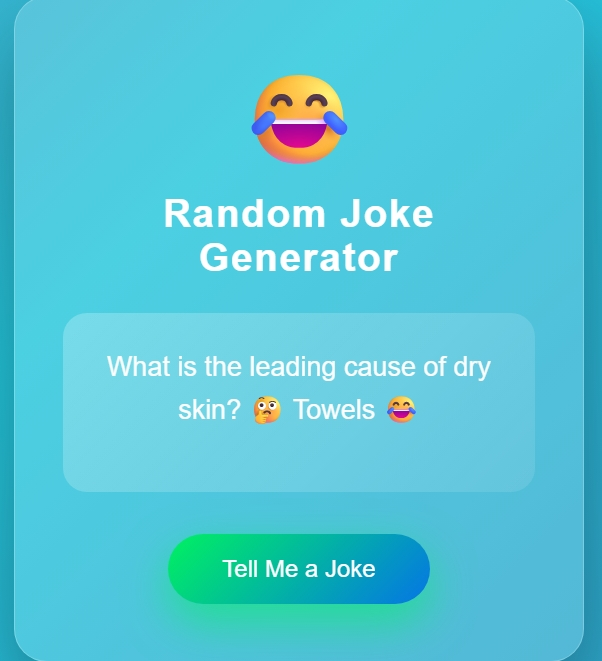

# 😂 Random Joke Generator

A fun and interactive **Random Joke Generator web app** built using **HTML, CSS, and JavaScript**.  
The app fetches jokes from a live API and displays them in a modern, colorful, and animated user interface.

---

## 🚀 Live Demo
_(Add GitHub Pages link here after enabling it)_

---

## 📖 About the Project

The **Random Joke Generator** is a simple frontend project that demonstrates how to work with **APIs** using JavaScript.  
Every time the user clicks the button, a new joke is fetched in real time and displayed on the screen.

This project is perfect for:
- JavaScript beginners  
- College mini projects  
- Frontend practice  
- GitHub & LinkedIn portfolio  

---

## ✨ Features
- Fetches random jokes from a public API  
- Uses `fetch()` with `async/await`  
- Attractive and colorful UI  
- Responsive design  
- Error handling for API failures  

---

## 🛠️ Technologies Used
- **HTML** – Structure  
- **CSS** – Styling & animations  
- **JavaScript** – Logic & API handling  

---
## 📸 Screenshot

